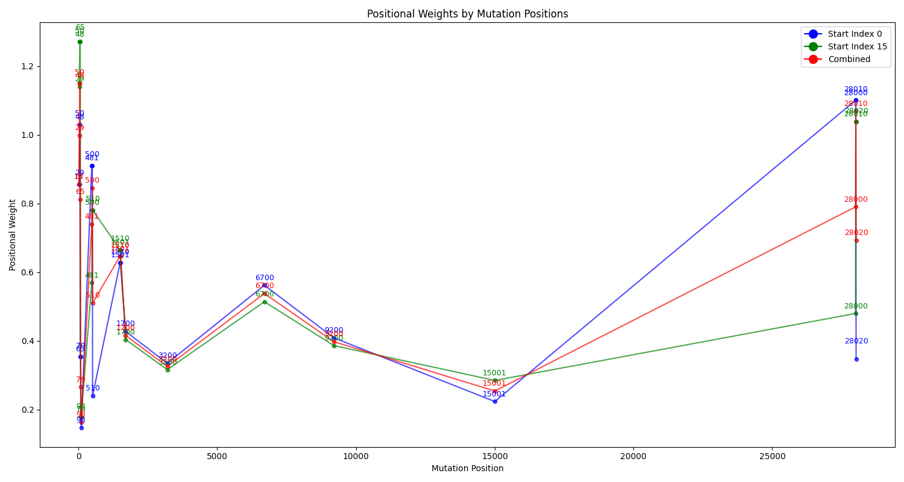
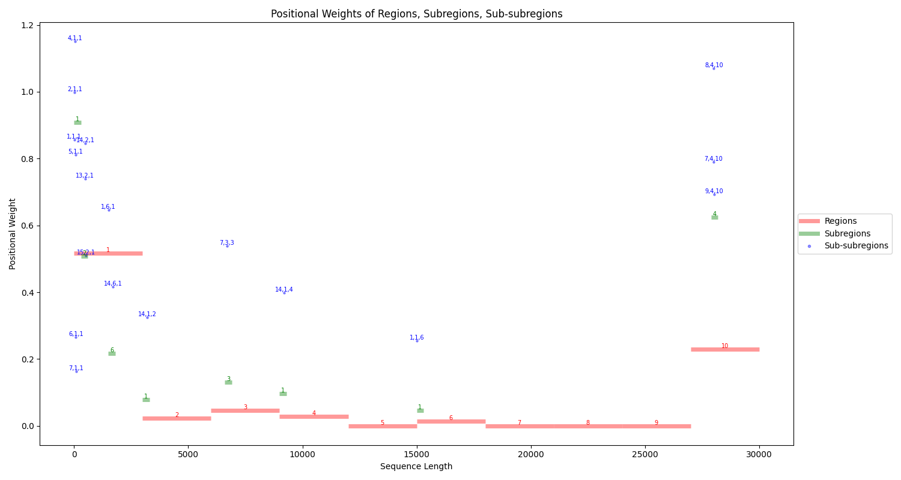
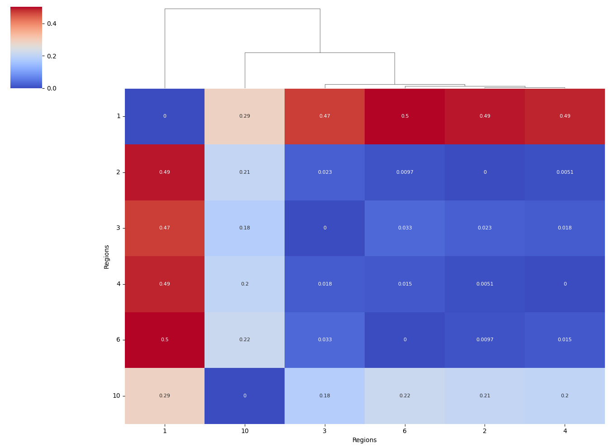
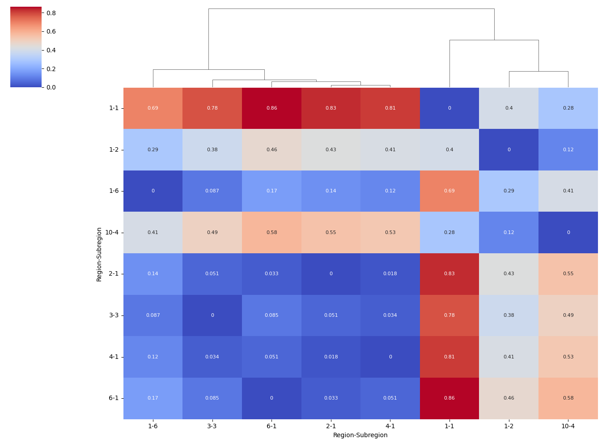
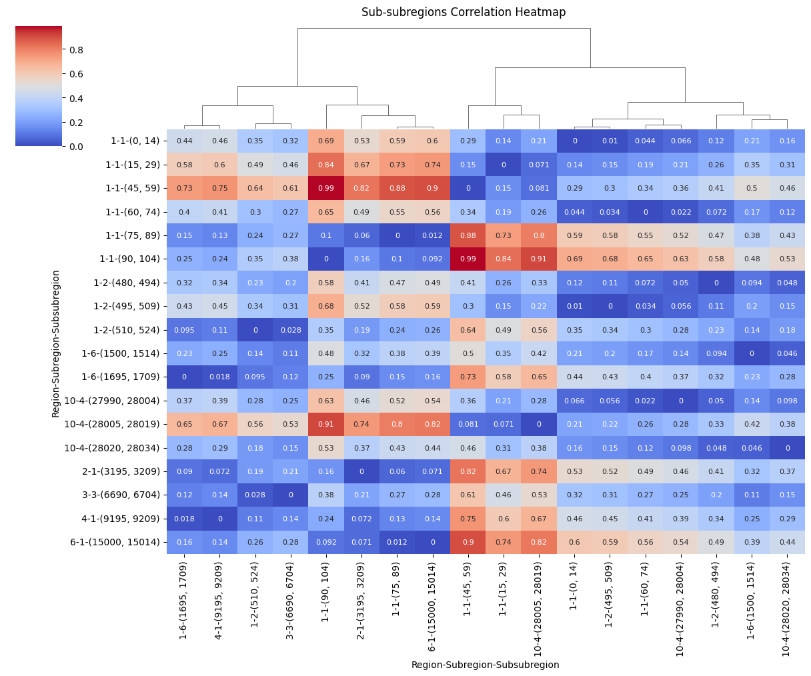

# ECMPIA: Encoding and Clustering Mutations Positional Impact Algorithm

The ECMPIA algorithm integrates partitioning and clustering methods to capture and analyze the positional impact of mutations (bases and regions) across DNA/RNA/protein sequences. It is designed to help researchers assess the impact of highly mutated bases and regions based on their positions and uncover the relationships between their positional impacts.

## Project Description

The ECMPIA repository serves as a toolkit for researchers to implement the ECMPIA algorithm for analyzing mutation positional impacts.

## Directory Structure

- `src`: Contains source code files.
- `mutations_data.csv`: Sample CSV file with mutation data.

## mutations_data.csv

This file contains sample mutation data with the following columns:
- `mut_positions` (integer): Mutation positions in the sequence.
- `impact_score` (float or integer): Impact score associated with mutations.

Replace the data in this file with your own mutation data before running the analysis.


## ECMPIA_result

This directory contains the output results from the algorithm. The following files are generated:
- `positional_weights_0.csv`: Mapped mutations and calculated positional weights for sub-subregions partitioned starting at index 0.
- `positional_weights_15.csv`: Mapped mutations and calculated positional weights for sub-subregions partitioned starting at index 15.
- `combined_data.csv`: Combined data from both sets of partitioned sub-subregions.
- `region_details.csv`: Detailed information about regions, subregions, and sub-subregions.
- `region_weights.csv`: Range and weight for each region.


## Plots

### Density, Scatter, Line, and Bar Plots

1. **Density Plot of Positional Weights**
   - Description: This plot shows the density of positional weights across sub-subregions partitioned starting at index 0, index 15, and the combined data.
   - 

2. **Scatter Plot of Positional Weights by Mutation Positions**
   - Description: This plot shows the positional weights by mutation positions for sub-subregions partitioned starting at index 0, index 15, and the combined data.
   - 

3. **Line Plot of Positional Weights by Sub-subregion Ranges**
   - Description: This plot shows the positional weights for sub-subregion ranges, with lines connecting the weights for sub-subregions partitioned starting at index 0, index 15, and the combined data.
   - 

4. **Bar Plot of Positional Weights Across Regions, Subregions, and Sub-subregions**
   - Description: This plot shows the positional weights across regions, subregions, and sub-subregions, with interval bars indicating the range and weight for each category.
   - 


## Heatmaps

### Correlation Heatmaps with Dendrogram Clustering on Columns

1. **Regions Correlation Heatmap**
   - Description: This heatmap shows the correlation between regions based on their positional weights.
   - 

2. **Subregions Correlation Heatmap**
   - Description: This heatmap shows the correlation between subregions based on their positional weights.
   - 

3. **Sub-subregions Correlation Heatmap**
   - Description: This heatmap shows the correlation between sub-subregions based on their positional weights.
   - 


## System Requirements

- macOS 10.15 or higher / Windows 10 or higher / Linux
- Python 3.9 or higher
- pip3 24
- *May work with similar versions.

## Installation Instructions

1. Clone the repository:
   ```bash
   git clone https://github.com/raeufroushangar/ECMPIA.git
   cd ECMPIA

2. Create a virtual environment inside the ECMPIA directory:
   ```bash
   python3 -m venv venv

3. Activate the virtual environment:

- On macOS and Linux:
   ```bash
   venv/bin/activate
- On Windows:
   ```bash
   .\venv\Scripts\activate

4. Install required packages
   ```bash
   pip install -r requirements.txt

5. Run analysis script:
   ```bash
   python3 ecmpia_main.py -l <sequence_length>

   note: Replace <sequence_length> with the length of your sequence. For example:
   python3 ecmpia_main.py -l 30000 

   To generate plots, include the --plot flag:
   python3 ecmpia_main.py -l 30000 --plot

6. To see the help message for the script:
   ```bash
   python3 ecmpia_main.py -h
